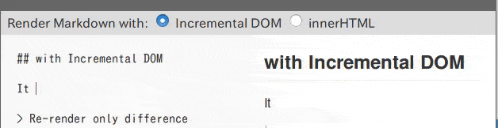

# markdown-it-incremental-dom

[](https://travis-ci.org/yhatt/markdown-it-incremental-dom)
[](https://coveralls.io/github/yhatt/markdown-it-incremental-dom?branch=master)
[](https://www.npmjs.com/package/markdown-it-incremental-dom)
[](./LICENSE)

A [markdown-it](https://github.com/markdown-it/markdown-it) renderer plugin by using [Incremental DOM](https://github.com/google/incremental-dom).

Let's see key features: **[https://yhatt.github.io/markdown-it-incremental-dom/](https://yhatt.github.io/markdown-it-incremental-dom/)** or [`docs.md`](docs/docs.md)

[](https://yhatt.github.io/markdown-it-incremental-dom/)

## Requirement

* [markdown-it](https://github.com/markdown-it/markdown-it) >= 4.0.0 (Recommend latest version >= 8.4.0, that this plugin use it)
* [Incremental DOM](https://github.com/google/incremental-dom) >= 0.5.x

## Examples

### Node.js

```javascript
const IncrementalDOM = require('incremental-dom')

const md = require('markdown-it')().use(
  require('markdown-it-incremental-dom'),
  IncrementalDOM
)

IncrementalDOM.patch(
  document.getElementById('target'),
  md.renderToIncrementalDOM('# Hello, Incremental DOM!')
)
```

### Browser

Define as `window.markdownitIncrementalDOM`.

```html
<!DOCTYPE HTML>
<html>
<head>
  <script src="https://ajax.googleapis.com/ajax/libs/incrementaldom/0.5.1/incremental-dom-min.js"></script>
  <script src="https://cdn.jsdelivr.net/markdown-it/8.3.1/markdown-it.min.js"></script>
  <script src="./node_modules/markdown-it-incremental-dom/dist/markdown-it-incremental-dom.min.js"></script>
</head>
<body>
  <div id="target"></div>

  <script>
    var md = new markdownit().use(markdownitIncrementalDOM)

    IncrementalDOM.patch(
      document.getElementById('target'),
      md.renderToIncrementalDOM('# Hello, Incremental DOM!')
    )
  </script>
</body>
</html>
```

#### CDN

You can use the recent version through CDN provides by [unpkg.com](https://unpkg.com/).

* **[Compressed (Recommend)](https://unpkg.com/markdown-it-incremental-dom/dist/markdown-it-incremental-dom.min.js)**
* [Uncompressed](https://unpkg.com/markdown-it-incremental-dom/dist/markdown-it-incremental-dom.js)

## Installation

We recommend using [yarn](https://yarnpkg.com/) to install.

```bash
$ yarn add incremental-dom markdown-it
$ yarn add markdown-it-incremental-dom
```

If you wanna use npm, try this:

```bash
$ npm install incremental-dom markdown-it --save
$ npm install markdown-it-incremental-dom --save
```

## Usage

When injecting this plugin by `.use()`, _you should pass Incremental DOM class as second argument._ (`window.IncrementalDOM` by default)

```javascript
const IncrementalDOM = require('incremental-dom')
const md = require('markdown-it')().use(
  require('markdown-it-incremental-dom'),
  IncrementalDOM
)
```

If it is succeed, [2 new rendering methods](#rendering-methods) would be injected to instance.

> **_TIPS:_** This plugin keeps default rendering methods [`render()`](https://markdown-it.github.io/markdown-it/#MarkdownIt.render) and [`renderInline()`](https://markdown-it.github.io/markdown-it/#MarkdownIt.renderInline).

### Option

You can pass option object as third argument. See below:

```javascript
require('markdown-it')().use(
  require('markdown-it-incremental-dom'),
  IncrementalDOM,
  {
    incrementalizeDefaultRules: true,
  }
)
```

* **`incrementalizeDefaultRules`**: For better performance, this plugin would override a few default renderer rules only when you calls injected methods. If the other plugins that override default rules have occured any problem, You can disable overriding by setting `false`. _(`true` by default)_

### Rendering methods

#### `MarkdownIt.renderToIncrementalDOM(src[, env]) => Function`

Similar to [`MarkdownIt.render(src[, env])`](https://markdown-it.github.io/markdown-it/#MarkdownIt.render) but _it returns a function for Incremental DOM_. It means doesn't render Markdown immediately.

You must render to DOM by using [`IncrementalDOM.patch(node, description)`](http://google.github.io/incremental-dom/#api/patch). Please pass the returned function to the description argument. For example:

```javascript
const node = document.getElementById('#target')
const func = md.renderToIncrementalDOM('# Hello, Incremental DOM!')

// It would render "<h1>Hello, Incremental DOM!</h1>" to <div id="target">
IncrementalDOM.patch(node, func)
```

#### `MarkdownIt.renderInlineToIncrementalDOM(src[, env]) => Function`

Similar to `MarkdownIt.renderToIncrementalDOM` but it wraps [`MarkdownIt.renderInline(src[, env])`](https://markdown-it.github.io/markdown-it/#MarkdownIt.renderInline).

## Development

```bash
$ git clone https://github.com/yhatt/markdown-it-incremental-dom

$ yarn install
$ yarn build
```

### Lint & Format

```bash
$ yarn lint            # Run ESLint and Prettier to JS
$ yarn lint --fix      # Fix lint and formatting of JS

$ yarn format          # Run Prettier to Markdown, JSON and CSS
$ yarn format --write  # Fix code formatting by Prettier
```

### Publish to npm

```bash
$ yarn publish
```

:warning: Use yarn >= 1.0.0 or npm >= 5.0.0.

## Author

Yuki Hattori ([@yhatt](https://github.com/yhatt/))

## License

This plugin releases under the [MIT License](https://github.com/yhatt/markdown-it-incremental-dom/blob/master/LICENSE).
