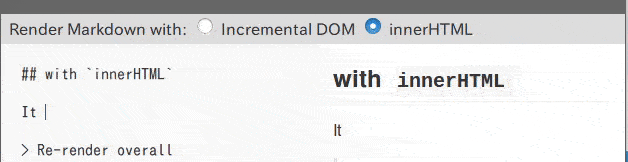

# markdown-it-incremental-dom

A [markdown-it](https://github.com/markdown-it/markdown-it) renderer plugin by using [Incremental DOM](https://github.com/google/incremental-dom). Say goodbye `innerHTML`!

## Features

* [markdown-it](https://github.com/markdown-it/markdown-it) could receive better rendering performance powered by [Incremental DOM](https://github.com/google/incremental-dom).
* [API](https://github.com/yhatt/markdown-it-incremental-dom/blob/master/README.md#usage) is compatible with existing render method.
* It can use with [other markdown-it plugins](https://www.npmjs.com/browse/keyword/markdown-it-plugin). (Of course incrementalize!)

## How to use

Refer below for the examples and usages.

* **Github: [yhatt/markdown-it-incremental-dom](https://github.com/yhatt/markdown-it-incremental-dom)**
* **npm: [markdown-it-incremental-dom](https://www.npmjs.com/package/markdown-it-incremental-dom)**

## Why Incremental DOM?

### Repainting on `innerHTML`

`Element.innerHTML` is the simplest way to update HTML. But it triggers repainting the whole passed HTML.

This is the visualization of repainting in innerHTML, and repainted area will be colorful. As you see, The whole markdown is always repainted.

It means _the rendering performance would slow in large markdown_ if `innerHTML` would be called many times in a short time. (e.g. live rendering feature)

### Incremental DOM

Google's [Incremental DOM](https://github.com/google/incremental-dom) can update DOMs by in-place. In other words, elements that have not changed contents or arguments are not changed on rendered DOM too.

As you see above, repainting is triggered to the differences only. So it would expect to _reduce the impact of repainting to the minimum_ by using Incremental DOM.

## Let's try!

In this page, you can switch rendering method of markdown: `innerHTML` and Incremental DOM.

If you wanna confirm the behavior of repainting, turn on paint flashing in developer tools of your browser.

> Helps are here: [Chrome](https://developers.google.com/web/fundamentals/performance/rendering/simplify-paint-complexity-and-reduce-paint-areas#chrome_devtools) and [Firefox](https://developer.mozilla.org/en-US/docs/Tools/Paint_Flashing_Tool)

## Author

Yuki Hattori ([@yhatt](https://github.com/yhatt/))

> markdown-it-incremental-dom is the sub-project of [Marp](https://github.com/yhatt/marp/).
